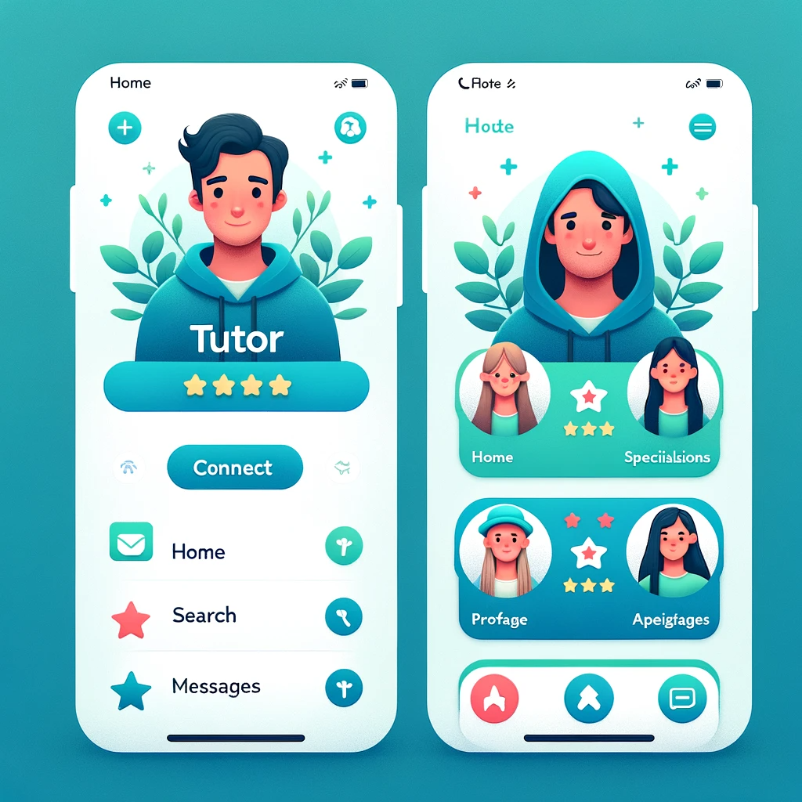
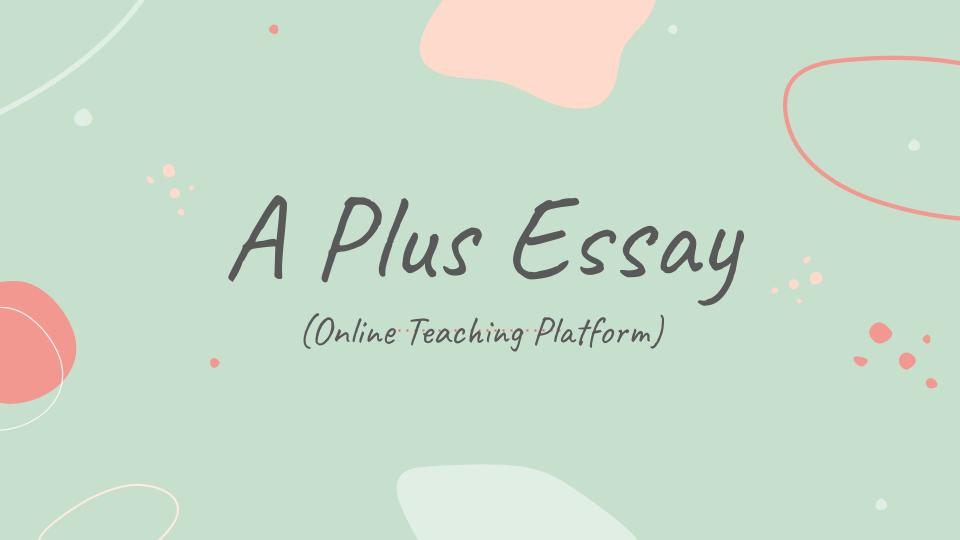
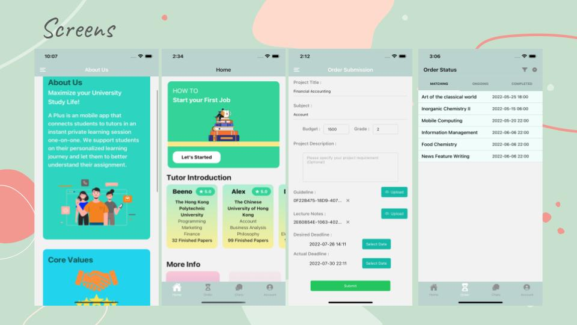
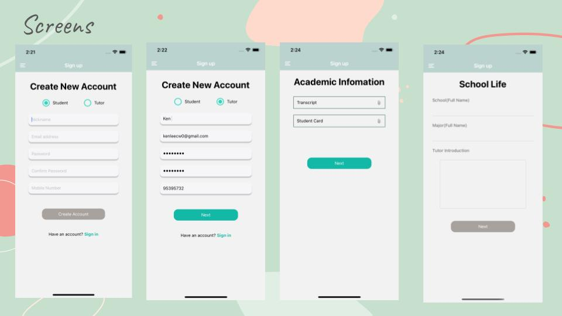
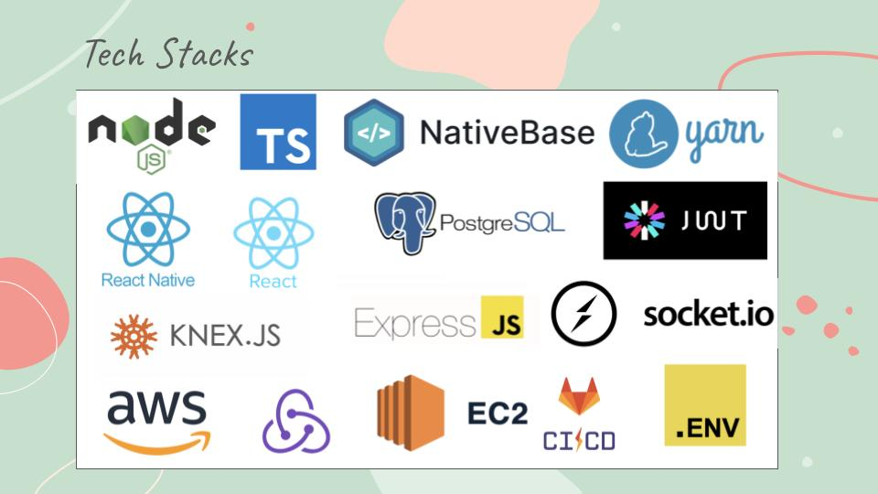
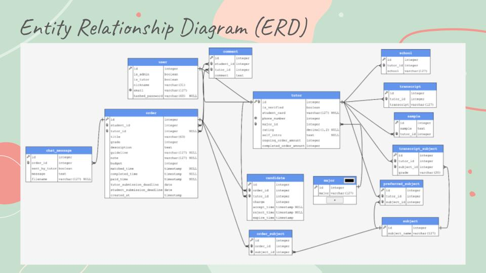
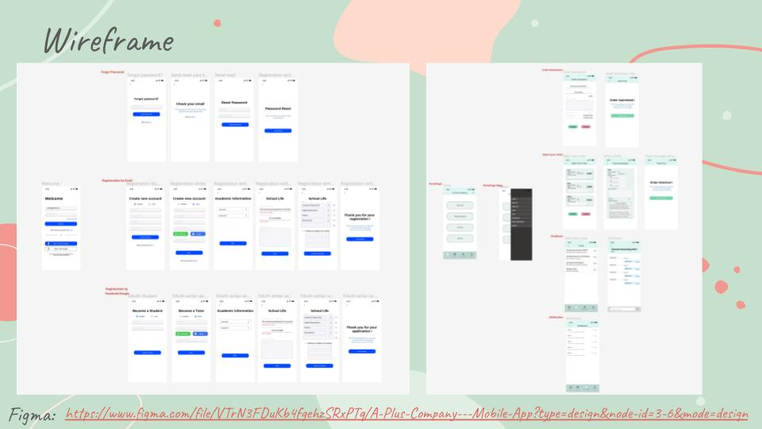
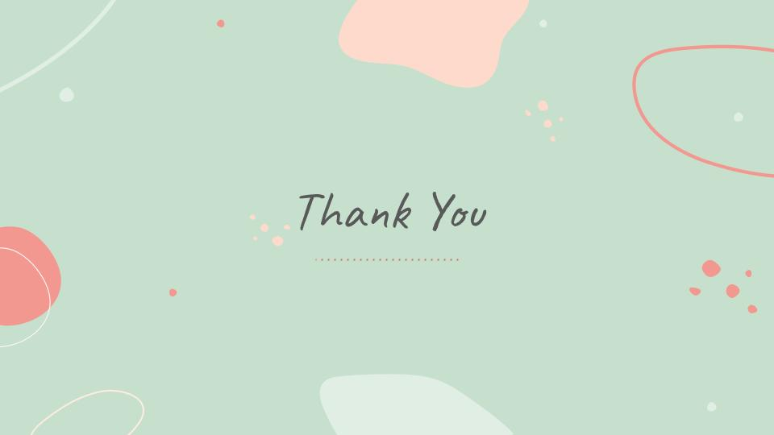

# A Plus Essay

## Introduction
Welcome to A Plus Essay, the mobile app that bridges the gap between students and knowledge by connecting them with expert tutors for instant private learning sessions. Our goal is to facilitate on-demand education and make learning accessible to everyone, everywhere.

## Features
- **Instant Connection**: Find a tutor in just a few taps and start learning right away.
- **Private Sessions**: Engage in one-on-one learning with experienced tutors.
- **Flexible Scheduling**: Arrange sessions that fit your timetable.
- **Diverse Subjects**: A wide range of topics and subjects available to study.
- **Intuitive Interface**: A user-friendly app designed for students of all ages.

## Technical Stack
Our app is crafted using a combination of cutting-edge technologies:
- Mobile Development: React Native, NativeBase
- Web Development: React, Typescript
- Backend: Node.js, Express.js
- Database: PostgreSQL
- Hosting & Operations: AWS EC2, AWS S3

## Getting Started
1. Clone the repository to your local machine.
2. Navigate to the project directory.
3. Install the necessary dependencies with `npm install`.
4. Set up your environment with the required configurations.
5. Run the app on your emulator or physical device with `npm start`.

## Acknowledgments
- Thanks to all the dedicated tutors who make this app a valuable learning resource.
- Shoutout to the React Native community for continuous support.

## Screenshots & Demo
Here's a sneak peek of A Plus Essay in action!

## Overview

